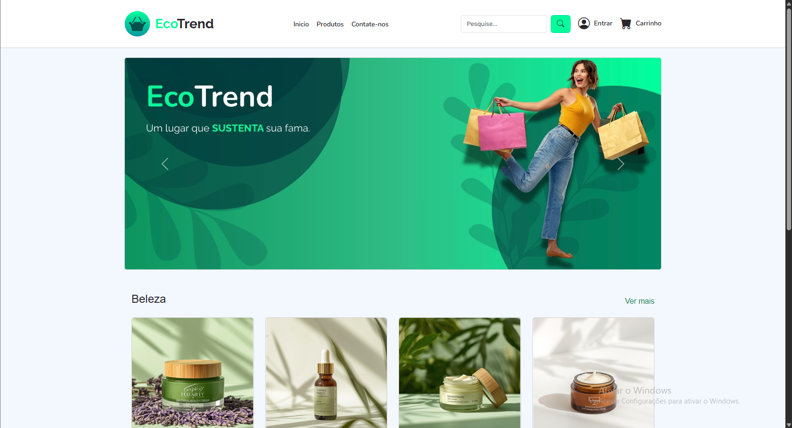

# 🌱 E-commerce Sustentável  EcoTrend

Trabalho desenvolvido para a disciplina de **Front-end** na **FIAP**, com o objetivo de praticar o uso do **Bootstrap** e do **CSS Grid Layout** no desenvolvimento de um layout moderno para um e-commerce de produtos sustentáveis.  

---

## 👨‍💻 Integrantes  
- Pedro Henrique dos Santos
- Pedro Cunha Coutinho
- Breno Henrique Bortoloti Santos
- Thomaz Vasconcelos Mendes
- Nicolas Tetsuo Kimura

---

## 📖 Sobre o Projeto  
O projeto consiste em uma página de e-commerce voltada para produtos sustentáveis, com foco em boas práticas de design responsivo e organização de layout.  

### Tecnologias utilizadas:  
- **Bootstrap** → para estilização rápida e responsiva.  
- **Bootstrap Icons** → para utilização de ícones prontos e modernos.  
- **CSS Grid Layout** → para estruturar o layout de forma flexível e organizada.  

---

## 🖼️ Layout do Projeto  

  

---
